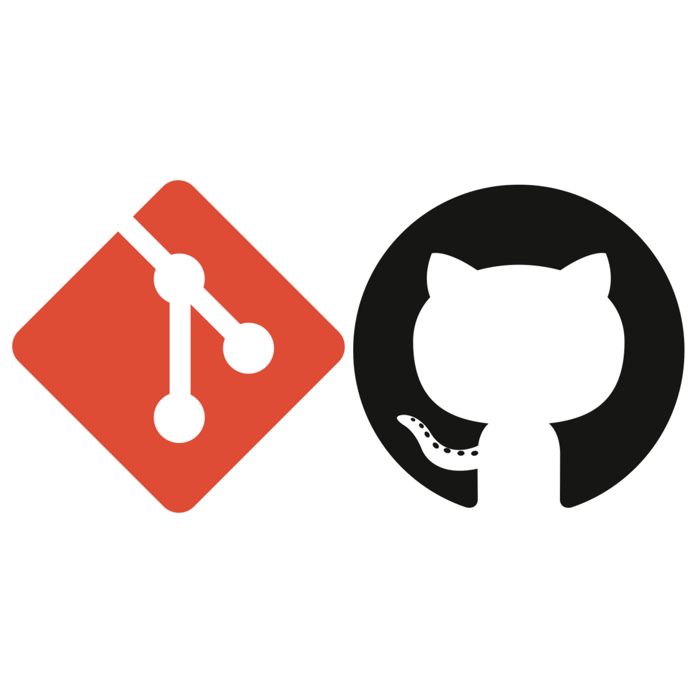
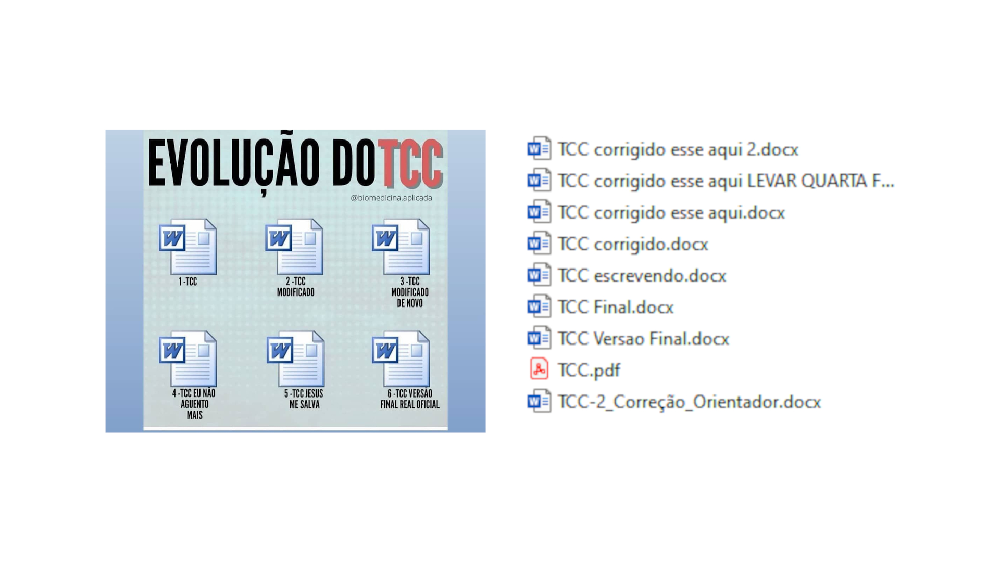
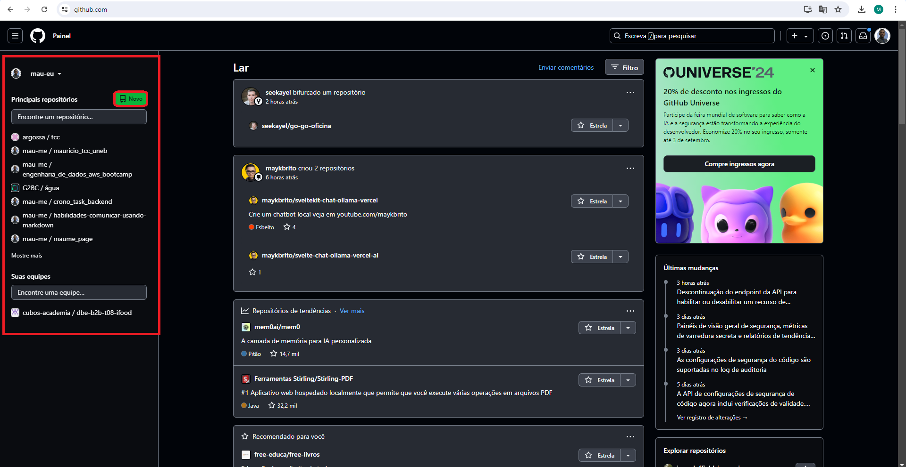
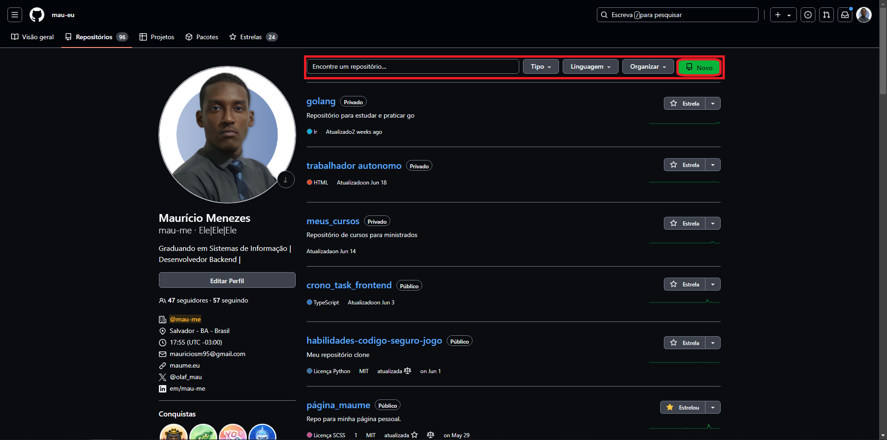
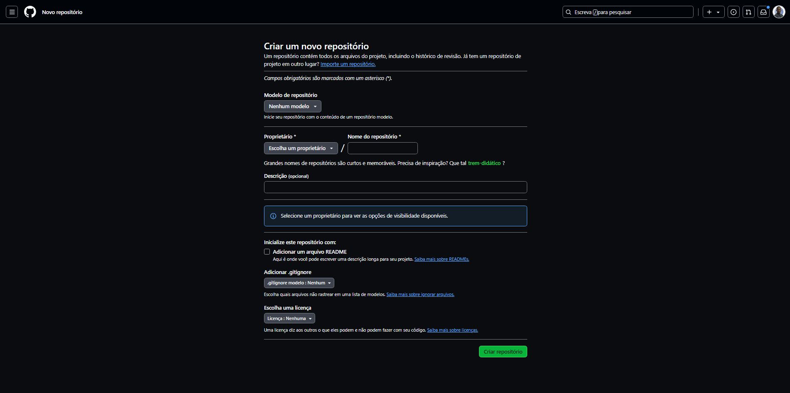

---
<!-- markdownlint-disable MD025 MD033 MD003 MD024 -->

<style>
  img[alt~="center"] {
   display: block;
   margin: 0 auto;
}
</style>

# Git e GitHub

## Colaboração e Controle de Versão para Qualquer Área de Conhecimento

<br/>

***Universidade do Estado da Bahia***
***JAPEX***

<style scoped>
h1 {
    padding-top: 1.5em;
}
</style>


---

# Mauricio Souza Menezes

- Bacharel em Sistema de Informação - UnEB
- Arquiteto/Desenvolvedor de Software (Renova)
- Pesquisador em Computação e Bioinformática (G2BC)

## Contato

- E-mail: <mauriciosm95@gmail.com>
- LinkedIn: <https://www.linkedin.com/in/mau-me/>
- GitHub: <https://github.com/mau-me>

---

# Objetivos da Apresentação

1. Entender o que é um Sistema de Controle de Versão.
2. Conhecer o Git e o GitHub.
3. Aprender as vantagens de utilizar o Git e o GitHub.
4. Conhecer os comandos básicos do Git.
5. Aprender a utilizar o Git e o GitHub.

---

# Sistema de Controle de Versão

---

# Por Quê Utilizar um Sistema de Controle de Versão?

---

# Organização de Arquivos



---

# O que é um Sistema de Controle de Versão - VCS?

- Sistema que registra alterações em um arquivo ou conjunto de arquivos ao longo do tempo.
- Arquivos de texto: código-fonte, documentos, etc.
- Arquivos binários: imagens, vídeos, etc.


---

# Por Quê Utilizar um Sistema de Controle de Versão?

1. Organização e Histórico de Alterações
2. Rastrear alterações em arquivos.
3. Garantir a recuperação de versões anteriores.
4. Facilitar a colaboração entre pessoas.

---

# Git e GitHub

---

# O que é Git?

- Git é um sistema de controle de versão distribuído.
- Ele foi inicialmente pensado para rastrear mudanças no código-fonte durante o desenvolvimento de software.
- Projetado para coordenar o trabalho entre programadores, mas pode ser usado para rastrear mudanças em qualquer conjunto de arquivos.
- Ele é um software livre e de código aberto.
- Ele foi criado por Linus Torvalds em 2005.

---

# O que é GitHub?

- GitHub é uma plataforma de hospedagem de código-fonte e arquivos baseado no Git.
- Ele permite que você e outras pessoas trabalhem juntas em projetos de qualquer lugar.
- Ele foi criado por Tom Preston-Werner, Chris Wanstrath, e PJ Hyett em 2008.
- Ele foi adquirido pela Microsoft em 2018.
- Ele é um serviço pago, mas também oferece planos gratuitos.

---

# GIT

---

# Como funciona o Git?

- Armazena os arquivos em um repositório.
- Trata seus arquivos como um conjunto de imagens.
- O Git tira uma "foto" de cada arquivo e armazena uma referência para essa "foto".
- Se o arquivo não foi alterado, o Git não tira outra "foto".
- Funciona como um fluxo do estado dos arquivos.

---

# Como funciona o Git?

## Fluxo de Estado dos Arquivos


---

# Como funciona o Git?

## Áreas de Trabalho do Git

- ***Working Directory***: É onde você trabalha nos arquivos.
- ***Staging Area***: É onde você prepara os arquivos para serem commitados.
- ***Repository***: É onde o Git armazena os arquivos e o histórico de alterações.

---

# Como funciona o Git?

## Fluxo de Trabalho do Git


---

# Git - Comandos Básicos

- `git init`: Inicializa um repositório Git.
- `git add <arquivo>`: Adiciona um arquivo ao repositório.
- `git add .`: Adiciona todos os arquivos ao repositório.
- `git commit -m "Mensagem"`: Faz um commit com uma mensagem.
- `git status`: Verifica o status do repositório.
- `git log`: Mostra o histórico de commits.
- `git diff`: Mostra as diferenças entre arquivos.

---

# Mão na Massa - Git

---

# Mão na Massa - Git - Instalação

## Instalação

- Instalar o Git: <https://git-scm.com/>
  - Windows: Download do instalador e executar.
  - Linux: Utilizar o gerenciador de pacotes.
    - Debian/Ubuntu: `sudo apt install git`
  - MacOS: Utilizar o Homebrew.
    - `brew install git`

---

# Mão na Massa - Git

## Instalação

- Verificar a instalação:

   ```bash
   git --version
   ```

- Criar uma conta no GitHub: <https://github.com/signup>

---

# Mão na massa - Git

## Configuração Inicial

Utilizando o terminal, execute os seguintes comandos:

   ```bash
   git config --global user.name "Fulano de Tal"
   git config --global user.email "fulanotal@email.com"
   ```

- Verificar a configuração:

   ```bash
   git config --global --list
   git config user.name
   ```

---

# Mão na massa - Git

- Criando um Diretório:

   ```bash
   mkdir -pv /projeto/git_github && cd /projeto/git_github
   ```

- Criar um repositório:

   ```bash
    git init
    ```

- Verificar status do repositório:

   ```bash
   git status
   ```

---

# Mão na massa - Git

- Adicionar arquivos ao repositório:

   ```bash
   git add .
   ```

- Fazer um commit:

   ```bash
    git commit -m "Primeiro commit"
    ```

- Verificar histórico de commits:

   ```bash
    git log
    ```

---

# Git - Gitignore

- O arquivo `.gitignore` é um arquivo de configuração do Git.
- Ele permite que você especifique arquivos e diretórios que o Git deve ignorar.
- Ele é útil para ignorar arquivos temporários, arquivos de compilação, arquivos de log, etc.
- Ele é um arquivo de texto simples.

---

# GitHub

---

# Mão na Massa - GitHub

## Criando um repositório no GitHub



---

# Mão na Massa - GitHub

## Criando um repositório no GitHub



---

# Mão na Massa - GitHub

## Criando um repositório no GitHub



---

# Mão na Massa - GitHub

## Criando um repositório no GitHub


---

# Mão na Massa - GitHub

## Clonando um repositório

- Copie a URL do repositório.
- No terminal, execute o comando:

   ```bash
   git clone <URL>
   ```

---

# Mão na Massa - GitHub

## Clonando um repositório

- Verificar o repositório clonado:

   ```bash
   ls -la
   ```

   ```bash
   cd <repositório>
   ls -la
   ```

   ```bash
   git status
   ```

---

# Mão na Massa - GitHub

## Pull e Push de Arquivos

- Adicionar arquivos ao repositório:

   ```bash
   git add .
   ```

- Fazer um commit:

   ```bash
    git commit -m "Primeiro commit"
    ```

- Enviar arquivos para o repositório remoto:

   ```bash
      git push origin master
   ```

---

# Mão na Massa - GitHub

## Pull e Push de Arquivos

- Atualizar o repositório local:

   ```bash
   git pull origin master
   ```

---

# Fluxo de Trabalho com o Git/GitHub


---

# O que estudar agora?

- Merges
- Chaves SSH e GPG
- Pull Request
- Fork
- Issues
- GitFlow

---

# OBRIGADO❣️

---

# DÚVIDAS QUE O CHATGPT NÃO RESPONDA

---

## Referências

- <https://git-scm.com/>
- <https://docs.github.com/pt/>
- <https://github.community/>
- <https://www.youtube.com/github>
- <https://www.atlassian.com/git/tutorials>
- <https://www.udemy.com/course/git-e-github-para-iniciantes/>
