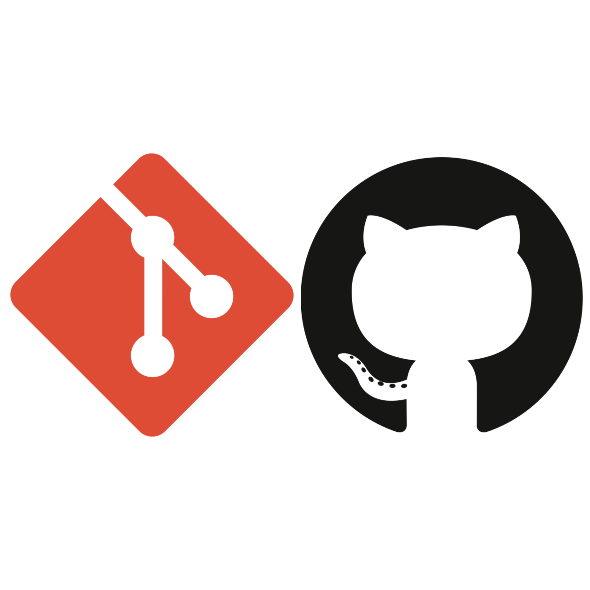

# Git e GitHub

Colaboração e Controle de Versão para Qualquer Área de Conhecimento

*JAPEX*

<style scoped>
h1 {
    padding-top: 1.5em;
}
</style>



---

## Mauricio Souza Menezes

### Bacharel em Sistema de Informação - UnEB

- Desenvolvedor de Software
- Pesquisador em Computação e Bioinformática (G2BC)

### Redes

- E-mail: <mauriciosm95@gmail.com>
- LinkedIn: <https://www.linkedin.com/in/mau-me/>
- GitHub: <https://github.com/mau-me>

---

## O que é Controle de Versão?

- Sistema que registra alterações em um arquivo ou conjunto de arquivos ao longo do tempo.
- Arquivos de texto: código-fonte, documentos, etc.
- Arquivos binários: imagens, vídeos, etc.


---

## O que é Git?

- Git é um sistema de controle de versão distribuído.
- Ele foi inicialmente pensado para rastrear mudanças no código-fonte durante o desenvolvimento de software.
- Projetado para coordenar o trabalho entre programadores, mas pode ser usado para rastrear mudanças em qualquer conjunto de arquivos.
- Ele é um software livre e de código aberto.
- Ele foi criado por Linus Torvalds em 2005.

---

## O que é GitHub?

- GitHub é uma plataforma de hospedagem de código-fonte e arquivos baseado no Git.
- Ele permite que você e outras pessoas trabalhem juntas em projetos de qualquer lugar.
- Ele foi criado por Tom Preston-Werner, Chris Wanstrath, e PJ Hyett em 2008.
- Ele foi adquirido pela Microsoft em 2018.
- Ele é um serviço pago, mas também oferece planos gratuitos.

---

## Por que usar Git e GitHub?

1. **Controle de Versão**: Permite rastrear mudanças em arquivos.
2. **Colaboração**: Permite que várias pessoas trabalhem juntas em um projeto.
3. **Backup**: Permite que você mantenha uma cópia de segurança do seu projeto.
4. **Histórico**: Permite que você veja o histórico de alterações em um projeto.
5. **Rastreamento de Problemas**: Permite que você rastreie problemas e solicitações de alterações.

---

## Como funciona o Git?

- Armazena os arquivos em um repositório.
- Trata seus arquivos como um conjunto de imagens.
- O Git tira uma "foto" de cada arquivo e armazena uma referência para essa "foto".
- Se o arquivo não foi alterado, o Git não tira outra "foto".
- Funciona como um fluxo do estado dos arquivos.

---

## Como funciona o Git?

### Armazenamento dos Arquivos


---

## Como funciona o Git?

### Estados dos Arquivos

- ***Working Directory***: É onde você trabalha nos arquivos.
- ***Staging Area***: É onde você prepara os arquivos para serem commitados.
- ***Repository***: É onde o Git armazena os arquivos e o histórico de alterações.

---

## Como funciona o Git?

### Fluxo de Trabalho do Git


---

## Git - Comandos Básicos

- `git init`: Inicializa um repositório Git.
- `git add <arquivo>`: Adiciona um arquivo ao repositório.
- `git add .`: Adiciona todos os arquivos ao repositório.
- `git commit -m "Mensagem"`: Faz um commit com uma mensagem.
- `git status`: Verifica o status do repositório.
- `git log`: Mostra o histórico de commits.
- `git diff`: Mostra as diferenças entre arquivos.

---

## Mão na massa - Git

- Instalar o Git: <https://git-scm.com/>
  - Windows: Download do instalador e executar.
  - Linux: Utilizar o gerenciador de pacotes.
    - Debian/Ubuntu: `sudo apt install git`
  - MacOS: Utilizar o Homebrew.
    - `brew install git`
- Criar uma conta no GitHub: <https://github.com/signup>
- Verificar a instalação:

   ```bash
   git --version
   ```

---

## Mão na massa - Git

- Configuração Inicial do Git:

Utilizando o terminal, execute os seguintes comandos:

   ```bash
   git config --global user.name "Fulano de Tal"
   git config --global user.email "fulanotal@email.com"
   ```

- Verificar a configuração:

   ```bash
   git config --global --list
   git config user.name
   ```

---

## Mão na massa - Git

- Criando um Diretório:

   ```bash
   mkdir -pv /projeto/git_github && cd /projeto/git_github
   ```

- Criar um repositório:

   ```bash
    git init
    ```

- Verificar status do repositório:

   ```bash
   git status
   ```

---

## Mão na massa - Git

- Adicionar arquivos ao repositório:

   ```bash
   git add .
   ```

- Fazer um commit:

   ```bash
    git commit -m "Primeiro commit"
    ```

- Verificar histórico de commits:

   ```bash
    git log
    ```

---

## Git - Gitingnore

- O arquivo `.gitignore` é um arquivo de configuração do Git.
- Ele permite que você especifique arquivos e diretórios que o Git deve ignorar.
- Ele é útil para ignorar arquivos temporários, arquivos de compilação, arquivos de log, etc.
- Ele é um arquivo de texto simples.

---

## Referências

- <https://git-scm.com/>
- <https://guides.github.com/>
- <https://www.atlassian.com/git/tutorials>
- <https://www.udemy.com/course/git-e-github-para-iniciantes/>
